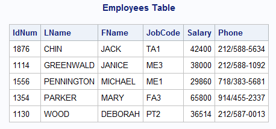
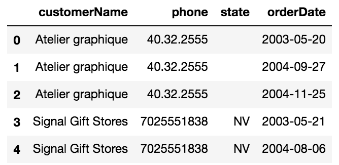
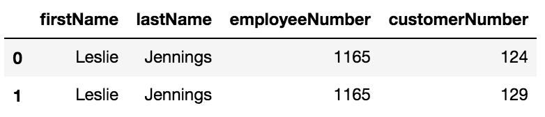
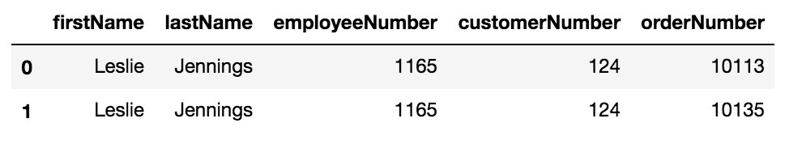
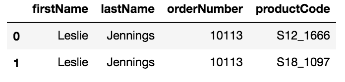
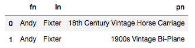

<h1>Table of Contents<span class="tocSkip"></span></h1>
<div class="toc"><ul class="toc-item"><li><span><a href="#Lesson-Structure" data-toc-modified-id="Lesson-Structure-1"><span class="toc-item-num">1&nbsp;&nbsp;</span>Lesson Structure</a></span><ul class="toc-item"><li><span><a href="#Questions" data-toc-modified-id="Questions-1.1"><span class="toc-item-num">1.1&nbsp;&nbsp;</span>Questions</a></span></li><li><span><a href="#Outcomes" data-toc-modified-id="Outcomes-1.2"><span class="toc-item-num">1.2&nbsp;&nbsp;</span>Outcomes</a></span></li><li><span><a href="#Objectives" data-toc-modified-id="Objectives-1.3"><span class="toc-item-num">1.3&nbsp;&nbsp;</span>Objectives</a></span></li><li><span><a href="#Outline" data-toc-modified-id="Outline-1.4"><span class="toc-item-num">1.4&nbsp;&nbsp;</span>Outline</a></span></li></ul></li><li><span><a href="#(5-min)-Warm-Up" data-toc-modified-id="(5-min)-Warm-Up-2"><span class="toc-item-num">2&nbsp;&nbsp;</span>(5 min) Warm Up</a></span></li><li><span><a href="#Demonstrating-SQLite-&amp;-Python" data-toc-modified-id="Demonstrating-SQLite-&amp;-Python-3"><span class="toc-item-num">3&nbsp;&nbsp;</span>Demonstrating SQLite &amp; Python</a></span><ul class="toc-item"><li><span><a href="#Connecting-to-our-sqlite-db-using-sqlite3" data-toc-modified-id="Connecting-to-our-sqlite-db-using-sqlite3-3.1"><span class="toc-item-num">3.1&nbsp;&nbsp;</span>Connecting to our sqlite db using sqlite3</a></span></li><li><span><a href="#Listing-the-tables-in-our-db" data-toc-modified-id="Listing-the-tables-in-our-db-3.2"><span class="toc-item-num">3.2&nbsp;&nbsp;</span>Listing the tables in our db</a></span></li><li><span><a href="#Now--select-everything-from-the-employees-table-just-to-get-a-feel-for-it" data-toc-modified-id="Now--select-everything-from-the-employees-table-just-to-get-a-feel-for-it-3.3"><span class="toc-item-num">3.3&nbsp;&nbsp;</span>Now  select everything from the employees table just to get a feel for it</a></span></li><li><span><a href="#Now-let's-load-this-into-a-dataframe-using-the-.read_sql-method,-we'll-use-some-of-the-same-components-from-above." data-toc-modified-id="Now-let's-load-this-into-a-dataframe-using-the-.read_sql-method,-we'll-use-some-of-the-same-components-from-above.-3.4"><span class="toc-item-num">3.4&nbsp;&nbsp;</span>Now let's load this into a dataframe using the <code>.read_sql</code> method, we'll use some of the same components from above.</a></span></li><li><span><a href="#(3-min)-What-are-the-pros-and-cons-of-loading-a-sql-query-into-a-dataframe?" data-toc-modified-id="(3-min)-What-are-the-pros-and-cons-of-loading-a-sql-query-into-a-dataframe?-3.5"><span class="toc-item-num">3.5&nbsp;&nbsp;</span>(3 min) What are the pros and cons of loading a sql query into a dataframe?</a></span></li><li><span><a href="#A-throwback-favorite" data-toc-modified-id="A-throwback-favorite-3.6"><span class="toc-item-num">3.6&nbsp;&nbsp;</span>A throwback favorite</a></span></li><li><span><a href="#WHY-SHOULD-YOU-ALWAYS-SPECIFY-YOUR-PRIMARY-KEYS!?" data-toc-modified-id="WHY-SHOULD-YOU-ALWAYS-SPECIFY-YOUR-PRIMARY-KEYS!?-3.7"><span class="toc-item-num">3.7&nbsp;&nbsp;</span>WHY SHOULD YOU ALWAYS SPECIFY YOUR PRIMARY KEYS!?</a></span></li></ul></li><li><span><a href="#Exercises" data-toc-modified-id="Exercises-4"><span class="toc-item-num">4&nbsp;&nbsp;</span>Exercises</a></span><ul class="toc-item"><li><span><a href="#Query-Exercise-1" data-toc-modified-id="Query-Exercise-1-4.1"><span class="toc-item-num">4.1&nbsp;&nbsp;</span>Query Exercise 1</a></span></li><li><span><a href="#Query-Exercise-2" data-toc-modified-id="Query-Exercise-2-4.2"><span class="toc-item-num">4.2&nbsp;&nbsp;</span>Query Exercise 2</a></span></li><li><span><a href="#Query-Exercise-3" data-toc-modified-id="Query-Exercise-3-4.3"><span class="toc-item-num">4.3&nbsp;&nbsp;</span>Query Exercise 3</a></span></li><li><span><a href="#Query-Exercise-4" data-toc-modified-id="Query-Exercise-4-4.4"><span class="toc-item-num">4.4&nbsp;&nbsp;</span>Query Exercise 4</a></span></li><li><span><a href="#Query-Exercise-5" data-toc-modified-id="Query-Exercise-5-4.5"><span class="toc-item-num">4.5&nbsp;&nbsp;</span>Query Exercise 5</a></span></li><li><span><a href="#Great!-It's-working.-Let's-add-some-group-by-to-remove-duplicates!" data-toc-modified-id="Great!-It's-working.-Let's-add-some-group-by-to-remove-duplicates!-4.6"><span class="toc-item-num">4.6&nbsp;&nbsp;</span>Great! It's working. Let's add some group by to remove duplicates!</a></span></li></ul></li></ul></div>

# Lesson Structure

## Questions
- in industry, are SQL query made in python or GUI for SQL itself used.
    - yes they are. SQL query's are used in python scripts to read and write from/into db tables
- what is going on in the background when conn = sqlite3.connect('data.sqlite') is being run
    - we are connecting python sqlite3 object to our db
- Why are some files .db, and others are just 'data_sqlite'?
    - depends on how they were saved and how they're structured
- Is there function to quick view the data once you load it in similar to .head() in pd?
    - 
- For Groupby functions is better to use SQL commands or Pandas
- Using select and where statements on joins, can you minimize the size of the length of query string
- can you join a filtered table to another table? - yes

## Outcomes

YWBAT
- perform a query that is ordered by a value
- load query results as a dataframe
- build functions to perform queries
- execute a query using multiple joins

## Objectives

- write an order by query on a given table
- convert the customers table to a dataframe using pandas and sqlite3
- compare and contrast using a dataframe vs using the results as a list, from a query
- write a single join query
- write a multiple join query

## Outline

* Take Questions
* Warm Up
* Connect to our sqlite db
* Compare and contrast reading a query as a list vs reading a query as a dataframe
* Practice various queries
* Complete a Join Query
* Complete a query using multiple Joins
* wrap up

# (5 min) Warm Up

Given the following 'Employees' table, write a query that completes the following task.  Send your query to me in a private chat here in zoom.

Expected Result:
- IdNum, LName, FName and Salary
- Order it by salary, starting with the highest salary



<details>
    <summary>Solution</summary>
    
```SQL
SELECT IdNum, LName, FName, Salary
FROM Employees
ORDER BY Salary DESC
```

```SQL
select idnum, lname, fname, salary
from employees
order by salary desc
```

</details>

# Demonstrating SQLite & Python


```python
import pandas as pd
import numpy as np

import sqlite3

import matplotlib.pyplot as plt
```

## Connecting to our sqlite db using sqlite3


```python
# what is a db? 
# collection of data (sometimes structured)
# you can store a database in a file or a database object on your computer or a server


# connecting to our db (file)
conn = sqlite3.connect('data.sqlite') 


# creating a curor object to interact with the database
cursor = conn.cursor()
```

### let's try some description stuff on our db connection


```python
cursor.description
```


    (('employeeNumber', None, None, None, None, None, None),
     ('lastName', None, None, None, None, None, None),
     ('firstName', None, None, None, None, None, None),
     ('extension', None, None, None, None, None, None),
     ('email', None, None, None, None, None, None),
     ('officeCode', None, None, None, None, None, None),
     ('reportsTo', None, None, None, None, None, None),
     ('jobTitle', None, None, None, None, None, None))


## Listing the tables in our db


```python
# table_names to be a list of my table_names

query = "SELECT name FROM sqlite_master WHERE type='table';"
res = cursor.execute(query).fetchall()


print(res) # Notice these are tuples, let's extract only the names in the next cell
```

    [('orderdetails',), ('payments',), ('offices',), ('customers',), ('orders',), ('productlines',), ('products',), ('employees',), ('contacts',), ('contacts2',)]


```python
table_names = []

for r in res:
    table_names.append(r[0])
table_names
```


    ['orderdetails',
     'payments',
     'offices',
     'customers',
     'orders',
     'productlines',
     'products',
     'employees',
     'contacts',
     'contacts2']


## Now  select everything from the employees table just to get a feel for it


```python
query = """ SELECT *
            FROM employees
        """


res = cursor.execute(query).fetchall()
print(res[:2])
```

    [('1002', 'Murphy', 'Diane', 'x5800', 'dmurphy@classicmodelcars.com', '1', '', 'President'), ('1056', 'Patterson', 'Mary', 'x4611', 'mpatterso@classicmodelcars.com', '1', '1002', 'VP Sales')]


## Now let's load this into a dataframe using the `.read_sql` method, we'll use some of the same components from above. 


```python
query = "select * from employees;"

df = pd.read_sql(query, conn)
df.head() # Check out that readability
```


<div>
<style scoped>
    .dataframe tbody tr th:only-of-type {
        vertical-align: middle;
    }

    .dataframe tbody tr th {
        vertical-align: top;
    }

    .dataframe thead th {
        text-align: right;
    }
</style>
<table border="1" class="dataframe">
  <thead>
    <tr style="text-align: right;">
      <th></th>
      <th>employeeNumber</th>
      <th>lastName</th>
      <th>firstName</th>
      <th>extension</th>
      <th>email</th>
      <th>officeCode</th>
      <th>reportsTo</th>
      <th>jobTitle</th>
    </tr>
  </thead>
  <tbody>
    <tr>
      <td>0</td>
      <td>1002</td>
      <td>Murphy</td>
      <td>Diane</td>
      <td>x5800</td>
      <td>dmurphy@classicmodelcars.com</td>
      <td>1</td>
      <td></td>
      <td>President</td>
    </tr>
    <tr>
      <td>1</td>
      <td>1056</td>
      <td>Patterson</td>
      <td>Mary</td>
      <td>x4611</td>
      <td>mpatterso@classicmodelcars.com</td>
      <td>1</td>
      <td>1002</td>
      <td>VP Sales</td>
    </tr>
    <tr>
      <td>2</td>
      <td>1076</td>
      <td>Firrelli</td>
      <td>Jeff</td>
      <td>x9273</td>
      <td>jfirrelli@classicmodelcars.com</td>
      <td>1</td>
      <td>1002</td>
      <td>VP Marketing</td>
    </tr>
    <tr>
      <td>3</td>
      <td>1088</td>
      <td>Patterson</td>
      <td>William</td>
      <td>x4871</td>
      <td>wpatterson@classicmodelcars.com</td>
      <td>6</td>
      <td>1056</td>
      <td>Sales Manager (APAC)</td>
    </tr>
    <tr>
      <td>4</td>
      <td>1102</td>
      <td>Bondur</td>
      <td>Gerard</td>
      <td>x5408</td>
      <td>gbondur@classicmodelcars.com</td>
      <td>4</td>
      <td>1056</td>
      <td>Sale Manager (EMEA)</td>
    </tr>
  </tbody>
</table>
</div>


## (3 min) What are the pros and cons of loading a sql query into a dataframe?
- Pros
    - Visually easier to look through in a dataframe
    - We can use the pandas API on our data which we know much better than SQL
    - We can get series as a list from pandas easier than sql, information is labeled
    - Each row is a dictionary

- Cons
    - Slicing is more difficult in pandas
    - Pandas uses a lot of memory


```python
def load_df(table_name=None, conn=conn):
    query = f"select * from {table_name};"
    df = pd.read_sql(query, conn)
    return df
```


```python
df2 = load_df(table_names[3])
df2.head()
```


<div>
<style scoped>
    .dataframe tbody tr th:only-of-type {
        vertical-align: middle;
    }

    .dataframe tbody tr th {
        vertical-align: top;
    }

    .dataframe thead th {
        text-align: right;
    }
</style>
<table border="1" class="dataframe">
  <thead>
    <tr style="text-align: right;">
      <th></th>
      <th>customerNumber</th>
      <th>customerName</th>
      <th>contactLastName</th>
      <th>contactFirstName</th>
      <th>phone</th>
      <th>addressLine1</th>
      <th>addressLine2</th>
      <th>city</th>
      <th>state</th>
      <th>postalCode</th>
      <th>country</th>
      <th>salesRepEmployeeNumber</th>
      <th>creditLimit</th>
    </tr>
  </thead>
  <tbody>
    <tr>
      <td>0</td>
      <td>103</td>
      <td>Atelier graphique</td>
      <td>Schmitt</td>
      <td>Carine</td>
      <td>40.32.2555</td>
      <td>54, rue Royale</td>
      <td></td>
      <td>Nantes</td>
      <td></td>
      <td>44000</td>
      <td>France</td>
      <td>1370</td>
      <td>21000.00</td>
    </tr>
    <tr>
      <td>1</td>
      <td>112</td>
      <td>Signal Gift Stores</td>
      <td>King</td>
      <td>Jean</td>
      <td>7025551838</td>
      <td>8489 Strong St.</td>
      <td></td>
      <td>Las Vegas</td>
      <td>NV</td>
      <td>83030</td>
      <td>USA</td>
      <td>1166</td>
      <td>71800.00</td>
    </tr>
    <tr>
      <td>2</td>
      <td>114</td>
      <td>Australian Collectors, Co.</td>
      <td>Ferguson</td>
      <td>Peter</td>
      <td>03 9520 4555</td>
      <td>636 St Kilda Road</td>
      <td>Level 3</td>
      <td>Melbourne</td>
      <td>Victoria</td>
      <td>3004</td>
      <td>Australia</td>
      <td>1611</td>
      <td>117300.00</td>
    </tr>
    <tr>
      <td>3</td>
      <td>119</td>
      <td>La Rochelle Gifts</td>
      <td>Labrune</td>
      <td>Janine</td>
      <td>40.67.8555</td>
      <td>67, rue des Cinquante Otages</td>
      <td></td>
      <td>Nantes</td>
      <td></td>
      <td>44000</td>
      <td>France</td>
      <td>1370</td>
      <td>118200.00</td>
    </tr>
    <tr>
      <td>4</td>
      <td>121</td>
      <td>Baane Mini Imports</td>
      <td>Bergulfsen</td>
      <td>Jonas</td>
      <td>07-98 9555</td>
      <td>Erling Skakkes gate 78</td>
      <td></td>
      <td>Stavern</td>
      <td></td>
      <td>4110</td>
      <td>Norway</td>
      <td>1504</td>
      <td>81700.00</td>
    </tr>
  </tbody>
</table>
</div>


## A throwback favorite 


```python
d = dict()

for table_name in table_names:
    d[table_name] = load_df(table_name=table_name)

print(d.keys())
```

    dict_keys(['orderdetails', 'payments', 'offices', 'customers', 'orders', 'productlines', 'products', 'employees', 'contacts', 'contacts2'])


```python
d['payments'].head()
```


<div>
<style scoped>
    .dataframe tbody tr th:only-of-type {
        vertical-align: middle;
    }

    .dataframe tbody tr th {
        vertical-align: top;
    }

    .dataframe thead th {
        text-align: right;
    }
</style>
<table border="1" class="dataframe">
  <thead>
    <tr style="text-align: right;">
      <th></th>
      <th>customerNumber</th>
      <th>checkNumber</th>
      <th>paymentDate</th>
      <th>amount</th>
    </tr>
  </thead>
  <tbody>
    <tr>
      <td>0</td>
      <td>103</td>
      <td>HQ336336</td>
      <td>2004-10-19</td>
      <td>6066.78</td>
    </tr>
    <tr>
      <td>1</td>
      <td>103</td>
      <td>JM555205</td>
      <td>2003-06-05</td>
      <td>14571.44</td>
    </tr>
    <tr>
      <td>2</td>
      <td>103</td>
      <td>OM314933</td>
      <td>2004-12-18</td>
      <td>1676.14</td>
    </tr>
    <tr>
      <td>3</td>
      <td>112</td>
      <td>BO864823</td>
      <td>2004-12-17</td>
      <td>14191.12</td>
    </tr>
    <tr>
      <td>4</td>
      <td>112</td>
      <td>HQ55022</td>
      <td>2003-06-06</td>
      <td>32641.98</td>
    </tr>
  </tbody>
</table>
</div>


### Lots of memory being used in the dictionary above

### What did we just learn?
- the actual output of a cursor query is a list of tuples
- dataframes are very harsh on resources on memory
    - should not be used on production
    - or really on any server
    - stick to json formatting or csv files
- You can simplify SQL tasks by creating python fuctions


```python

```


```python

```

## WHY SHOULD YOU ALWAYS SPECIFY YOUR PRIMARY KEYS!?

[Discussion here]


```python
def get_pragma_of_table(table_name=None, conn=conn):
    print(table_name)
    query = f'PRAGMA table_info({table_name});'
    df = pd.read_sql(query, conn)
    return df
```


```python
get_pragma_of_table(table_name=table_names[2])
```

    offices


<div>
<style scoped>
    .dataframe tbody tr th:only-of-type {
        vertical-align: middle;
    }

    .dataframe tbody tr th {
        vertical-align: top;
    }

    .dataframe thead th {
        text-align: right;
    }
</style>
<table border="1" class="dataframe">
  <thead>
    <tr style="text-align: right;">
      <th></th>
      <th>cid</th>
      <th>name</th>
      <th>type</th>
      <th>notnull</th>
      <th>dflt_value</th>
      <th>pk</th>
    </tr>
  </thead>
  <tbody>
    <tr>
      <td>0</td>
      <td>0</td>
      <td>officeCode</td>
      <td></td>
      <td>0</td>
      <td>None</td>
      <td>0</td>
    </tr>
    <tr>
      <td>1</td>
      <td>1</td>
      <td>city</td>
      <td></td>
      <td>0</td>
      <td>None</td>
      <td>0</td>
    </tr>
    <tr>
      <td>2</td>
      <td>2</td>
      <td>phone</td>
      <td></td>
      <td>0</td>
      <td>None</td>
      <td>0</td>
    </tr>
    <tr>
      <td>3</td>
      <td>3</td>
      <td>addressLine1</td>
      <td></td>
      <td>0</td>
      <td>None</td>
      <td>0</td>
    </tr>
    <tr>
      <td>4</td>
      <td>4</td>
      <td>addressLine2</td>
      <td></td>
      <td>0</td>
      <td>None</td>
      <td>0</td>
    </tr>
    <tr>
      <td>5</td>
      <td>5</td>
      <td>state</td>
      <td></td>
      <td>0</td>
      <td>None</td>
      <td>0</td>
    </tr>
    <tr>
      <td>6</td>
      <td>6</td>
      <td>country</td>
      <td></td>
      <td>0</td>
      <td>None</td>
      <td>0</td>
    </tr>
    <tr>
      <td>7</td>
      <td>7</td>
      <td>postalCode</td>
      <td></td>
      <td>0</td>
      <td>None</td>
      <td>0</td>
    </tr>
    <tr>
      <td>8</td>
      <td>8</td>
      <td>territory</td>
      <td></td>
      <td>0</td>
      <td>None</td>
      <td>0</td>
    </tr>
  </tbody>
</table>
</div>


# Exercises

## Query Exercise 1

Create the following table using the customers table and the orders table




```python
display(d['customers'].head(1))
display(d['orders'].head(1))
```


<div>
<style scoped>
    .dataframe tbody tr th:only-of-type {
        vertical-align: middle;
    }

    .dataframe tbody tr th {
        vertical-align: top;
    }

    .dataframe thead th {
        text-align: right;
    }
</style>
<table border="1" class="dataframe">
  <thead>
    <tr style="text-align: right;">
      <th></th>
      <th>customerNumber</th>
      <th>customerName</th>
      <th>contactLastName</th>
      <th>contactFirstName</th>
      <th>phone</th>
      <th>addressLine1</th>
      <th>addressLine2</th>
      <th>city</th>
      <th>state</th>
      <th>postalCode</th>
      <th>country</th>
      <th>salesRepEmployeeNumber</th>
      <th>creditLimit</th>
    </tr>
  </thead>
  <tbody>
    <tr>
      <td>0</td>
      <td>103</td>
      <td>Atelier graphique</td>
      <td>Schmitt</td>
      <td>Carine</td>
      <td>40.32.2555</td>
      <td>54, rue Royale</td>
      <td></td>
      <td>Nantes</td>
      <td></td>
      <td>44000</td>
      <td>France</td>
      <td>1370</td>
      <td>21000.00</td>
    </tr>
  </tbody>
</table>
</div>


<div>
<style scoped>
    .dataframe tbody tr th:only-of-type {
        vertical-align: middle;
    }

    .dataframe tbody tr th {
        vertical-align: top;
    }

    .dataframe thead th {
        text-align: right;
    }
</style>
<table border="1" class="dataframe">
  <thead>
    <tr style="text-align: right;">
      <th></th>
      <th>orderNumber</th>
      <th>orderDate</th>
      <th>requiredDate</th>
      <th>shippedDate</th>
      <th>status</th>
      <th>comments</th>
      <th>customerNumber</th>
    </tr>
  </thead>
  <tbody>
    <tr>
      <td>0</td>
      <td>10100</td>
      <td>2003-01-06</td>
      <td>2003-01-13</td>
      <td>2003-01-10</td>
      <td>Shipped</td>
      <td></td>
      <td>363</td>
    </tr>
  </tbody>
</table>
</div>


```python
# First look at the customers dataframe 
query = """
        SELECT customername, phone, state, orderdate from customers
        JOIN orders
        USING(customernumber)
        """

# Then look at the orders dataframe
pd.read_sql(query, conn).head(3)

```


<div>
<style scoped>
    .dataframe tbody tr th:only-of-type {
        vertical-align: middle;
    }

    .dataframe tbody tr th {
        vertical-align: top;
    }

    .dataframe thead th {
        text-align: right;
    }
</style>
<table border="1" class="dataframe">
  <thead>
    <tr style="text-align: right;">
      <th></th>
      <th>customerName</th>
      <th>phone</th>
      <th>state</th>
      <th>orderDate</th>
    </tr>
  </thead>
  <tbody>
    <tr>
      <td>0</td>
      <td>Atelier graphique</td>
      <td>40.32.2555</td>
      <td></td>
      <td>2003-05-20</td>
    </tr>
    <tr>
      <td>1</td>
      <td>Atelier graphique</td>
      <td>40.32.2555</td>
      <td></td>
      <td>2004-09-27</td>
    </tr>
    <tr>
      <td>2</td>
      <td>Atelier graphique</td>
      <td>40.32.2555</td>
      <td></td>
      <td>2004-11-25</td>
    </tr>
  </tbody>
</table>
</div>


<details>
    <summary>Query 1 - Solution</summary>
    
```python
    query = """
    SELECT c.customerName, c.phone, c.state, o.orderDate FROM
    customers as c
    JOIN orders as o using (customerNumber);
    """
```
</details>


```python
query = """SELECT
        """
```


```python
join_1 = pd.read_sql(query, conn)
join_1.head()
```

## Query Exercise 2

Create a query that results in a table with the every customer number for an employee along with the employee name and number.

Ex:




```python
display(load_df('customers').head(1))
display(load_df('orders').head(1))
display(load_df('employees').head(1))
```


<div>
<style scoped>
    .dataframe tbody tr th:only-of-type {
        vertical-align: middle;
    }

    .dataframe tbody tr th {
        vertical-align: top;
    }

    .dataframe thead th {
        text-align: right;
    }
</style>
<table border="1" class="dataframe">
  <thead>
    <tr style="text-align: right;">
      <th></th>
      <th>customerNumber</th>
      <th>customerName</th>
      <th>contactLastName</th>
      <th>contactFirstName</th>
      <th>phone</th>
      <th>addressLine1</th>
      <th>addressLine2</th>
      <th>city</th>
      <th>state</th>
      <th>postalCode</th>
      <th>country</th>
      <th>salesRepEmployeeNumber</th>
      <th>creditLimit</th>
    </tr>
  </thead>
  <tbody>
    <tr>
      <td>0</td>
      <td>103</td>
      <td>Atelier graphique</td>
      <td>Schmitt</td>
      <td>Carine</td>
      <td>40.32.2555</td>
      <td>54, rue Royale</td>
      <td></td>
      <td>Nantes</td>
      <td></td>
      <td>44000</td>
      <td>France</td>
      <td>1370</td>
      <td>21000.00</td>
    </tr>
  </tbody>
</table>
</div>


<div>
<style scoped>
    .dataframe tbody tr th:only-of-type {
        vertical-align: middle;
    }

    .dataframe tbody tr th {
        vertical-align: top;
    }

    .dataframe thead th {
        text-align: right;
    }
</style>
<table border="1" class="dataframe">
  <thead>
    <tr style="text-align: right;">
      <th></th>
      <th>orderNumber</th>
      <th>orderDate</th>
      <th>requiredDate</th>
      <th>shippedDate</th>
      <th>status</th>
      <th>comments</th>
      <th>customerNumber</th>
    </tr>
  </thead>
  <tbody>
    <tr>
      <td>0</td>
      <td>10100</td>
      <td>2003-01-06</td>
      <td>2003-01-13</td>
      <td>2003-01-10</td>
      <td>Shipped</td>
      <td></td>
      <td>363</td>
    </tr>
  </tbody>
</table>
</div>


<div>
<style scoped>
    .dataframe tbody tr th:only-of-type {
        vertical-align: middle;
    }

    .dataframe tbody tr th {
        vertical-align: top;
    }

    .dataframe thead th {
        text-align: right;
    }
</style>
<table border="1" class="dataframe">
  <thead>
    <tr style="text-align: right;">
      <th></th>
      <th>employeeNumber</th>
      <th>lastName</th>
      <th>firstName</th>
      <th>extension</th>
      <th>email</th>
      <th>officeCode</th>
      <th>reportsTo</th>
      <th>jobTitle</th>
    </tr>
  </thead>
  <tbody>
    <tr>
      <td>0</td>
      <td>1002</td>
      <td>Murphy</td>
      <td>Diane</td>
      <td>x5800</td>
      <td>dmurphy@classicmodelcars.com</td>
      <td>1</td>
      <td></td>
      <td>President</td>
    </tr>
  </tbody>
</table>
</div>


```python
# Work here
```


```python
query = """
        SELECT e.firstname, e.lastname, e.employeenumber, c.customernumber
        from employees as e
        join customers c
        on e.employeeNumber=c.salesRepEmployeeNumber;
        """

pd.read_sql(query, conn).head()
```


<div>
<style scoped>
    .dataframe tbody tr th:only-of-type {
        vertical-align: middle;
    }

    .dataframe tbody tr th {
        vertical-align: top;
    }

    .dataframe thead th {
        text-align: right;
    }
</style>
<table border="1" class="dataframe">
  <thead>
    <tr style="text-align: right;">
      <th></th>
      <th>firstName</th>
      <th>lastName</th>
      <th>employeeNumber</th>
      <th>customerNumber</th>
    </tr>
  </thead>
  <tbody>
    <tr>
      <td>0</td>
      <td>Leslie</td>
      <td>Jennings</td>
      <td>1165</td>
      <td>124</td>
    </tr>
    <tr>
      <td>1</td>
      <td>Leslie</td>
      <td>Jennings</td>
      <td>1165</td>
      <td>129</td>
    </tr>
    <tr>
      <td>2</td>
      <td>Leslie</td>
      <td>Jennings</td>
      <td>1165</td>
      <td>161</td>
    </tr>
    <tr>
      <td>3</td>
      <td>Leslie</td>
      <td>Jennings</td>
      <td>1165</td>
      <td>321</td>
    </tr>
    <tr>
      <td>4</td>
      <td>Leslie</td>
      <td>Jennings</td>
      <td>1165</td>
      <td>450</td>
    </tr>
  </tbody>
</table>
</div>


<details>
    <summary> Query 2 - Solution</summary>
    
```python
query = """
    select e.firstname, e.lastname, e.employeenumber, c.customerNumber
    from employees as e
    join customers as c
    on e.employeenumber = c.salesrepemployeenumber;"""
```
    
</details>


```python
# Now let's take this and incorporate the next table orders
orders_df.head(1)
```

## Query Exercise 3

Create a query that results in a table with every order number for every customer number for an employee along with the employee name and number.

Ex:




```python
display(load_df('customers').head(1))
display(load_df('orders').head(1))
display(load_df('employees').head(1))
```


<div>
<style scoped>
    .dataframe tbody tr th:only-of-type {
        vertical-align: middle;
    }

    .dataframe tbody tr th {
        vertical-align: top;
    }

    .dataframe thead th {
        text-align: right;
    }
</style>
<table border="1" class="dataframe">
  <thead>
    <tr style="text-align: right;">
      <th></th>
      <th>customerNumber</th>
      <th>customerName</th>
      <th>contactLastName</th>
      <th>contactFirstName</th>
      <th>phone</th>
      <th>addressLine1</th>
      <th>addressLine2</th>
      <th>city</th>
      <th>state</th>
      <th>postalCode</th>
      <th>country</th>
      <th>salesRepEmployeeNumber</th>
      <th>creditLimit</th>
    </tr>
  </thead>
  <tbody>
    <tr>
      <td>0</td>
      <td>103</td>
      <td>Atelier graphique</td>
      <td>Schmitt</td>
      <td>Carine</td>
      <td>40.32.2555</td>
      <td>54, rue Royale</td>
      <td></td>
      <td>Nantes</td>
      <td></td>
      <td>44000</td>
      <td>France</td>
      <td>1370</td>
      <td>21000.00</td>
    </tr>
  </tbody>
</table>
</div>


<div>
<style scoped>
    .dataframe tbody tr th:only-of-type {
        vertical-align: middle;
    }

    .dataframe tbody tr th {
        vertical-align: top;
    }

    .dataframe thead th {
        text-align: right;
    }
</style>
<table border="1" class="dataframe">
  <thead>
    <tr style="text-align: right;">
      <th></th>
      <th>orderNumber</th>
      <th>orderDate</th>
      <th>requiredDate</th>
      <th>shippedDate</th>
      <th>status</th>
      <th>comments</th>
      <th>customerNumber</th>
    </tr>
  </thead>
  <tbody>
    <tr>
      <td>0</td>
      <td>10100</td>
      <td>2003-01-06</td>
      <td>2003-01-13</td>
      <td>2003-01-10</td>
      <td>Shipped</td>
      <td></td>
      <td>363</td>
    </tr>
  </tbody>
</table>
</div>


<div>
<style scoped>
    .dataframe tbody tr th:only-of-type {
        vertical-align: middle;
    }

    .dataframe tbody tr th {
        vertical-align: top;
    }

    .dataframe thead th {
        text-align: right;
    }
</style>
<table border="1" class="dataframe">
  <thead>
    <tr style="text-align: right;">
      <th></th>
      <th>employeeNumber</th>
      <th>lastName</th>
      <th>firstName</th>
      <th>extension</th>
      <th>email</th>
      <th>officeCode</th>
      <th>reportsTo</th>
      <th>jobTitle</th>
    </tr>
  </thead>
  <tbody>
    <tr>
      <td>0</td>
      <td>1002</td>
      <td>Murphy</td>
      <td>Diane</td>
      <td>x5800</td>
      <td>dmurphy@classicmodelcars.com</td>
      <td>1</td>
      <td></td>
      <td>President</td>
    </tr>
  </tbody>
</table>
</div>


```python
# Work here
```


```python
query = """
        select e.firstname, e.lastname, e.employeenumber, c.customerNumber, o.ordernumber
        from employees as e
        join customers as c
        on e.employeenumber = c.salesrepemployeenumber
        join orders as o
        using(customernumber);
        """

pd.read_sql(query, conn).head()
```


<div>
<style scoped>
    .dataframe tbody tr th:only-of-type {
        vertical-align: middle;
    }

    .dataframe tbody tr th {
        vertical-align: top;
    }

    .dataframe thead th {
        text-align: right;
    }
</style>
<table border="1" class="dataframe">
  <thead>
    <tr style="text-align: right;">
      <th></th>
      <th>firstName</th>
      <th>lastName</th>
      <th>employeeNumber</th>
      <th>customerNumber</th>
      <th>orderNumber</th>
    </tr>
  </thead>
  <tbody>
    <tr>
      <td>0</td>
      <td>Leslie</td>
      <td>Jennings</td>
      <td>1165</td>
      <td>124</td>
      <td>10113</td>
    </tr>
    <tr>
      <td>1</td>
      <td>Leslie</td>
      <td>Jennings</td>
      <td>1165</td>
      <td>124</td>
      <td>10135</td>
    </tr>
    <tr>
      <td>2</td>
      <td>Leslie</td>
      <td>Jennings</td>
      <td>1165</td>
      <td>124</td>
      <td>10142</td>
    </tr>
    <tr>
      <td>3</td>
      <td>Leslie</td>
      <td>Jennings</td>
      <td>1165</td>
      <td>124</td>
      <td>10182</td>
    </tr>
    <tr>
      <td>4</td>
      <td>Leslie</td>
      <td>Jennings</td>
      <td>1165</td>
      <td>124</td>
      <td>10229</td>
    </tr>
  </tbody>
</table>
</div>


<details>
    <summary> Query 3 - Solution</summary>

```python
query = """
    select e.firstname, e.lastname, e.employeenumber, c.customerNumber, o.orderNumber
    from employees as e
    join customers as c
    on e.employeenumber = c.salesrepemployeenumber
    join orders as o
    on o.customerNumber = c.customerNumber;"""
```
    
</details>

## Query Exercise 4

Write a query that results in the following:

Employee First and Last Name, order number and each product code for that order. 

*There should be a row for each product code*

Screenshot:




```python
# work here
query = """
        select
        """

pd.read_sql(query, conn).head(2)
```

<details>
    <summary>Query 4 Solution</summary>
    
```python
query = """
    select e.firstname, e.lastname, o.orderNumber, od.productCode
    from employees as e
    join customers as c
    on e.employeenumber = c.salesrepemployeenumber
    join orders as o
    on o.customerNumber = c.customerNumber
    join orderdetails as od
    on od.orderNumber = o.orderNumber;"""
    ```
        
</details>

## Query Exercise 5

Write a query that results in the following:

Employee First and Last Name and each product name they sold, add an alias to match the image below

*There should be a row for each product name*

Screenshot:




```python
display(load_df('customers').head(1))
display(load_df('orders').head(1))
display(load_df('orderdetails').head(1))
display(load_df('employees').head(1))
display(load_df('products').head(1))
```


<div>
<style scoped>
    .dataframe tbody tr th:only-of-type {
        vertical-align: middle;
    }

    .dataframe tbody tr th {
        vertical-align: top;
    }

    .dataframe thead th {
        text-align: right;
    }
</style>
<table border="1" class="dataframe">
  <thead>
    <tr style="text-align: right;">
      <th></th>
      <th>customerNumber</th>
      <th>customerName</th>
      <th>contactLastName</th>
      <th>contactFirstName</th>
      <th>phone</th>
      <th>addressLine1</th>
      <th>addressLine2</th>
      <th>city</th>
      <th>state</th>
      <th>postalCode</th>
      <th>country</th>
      <th>salesRepEmployeeNumber</th>
      <th>creditLimit</th>
    </tr>
  </thead>
  <tbody>
    <tr>
      <td>0</td>
      <td>103</td>
      <td>Atelier graphique</td>
      <td>Schmitt</td>
      <td>Carine</td>
      <td>40.32.2555</td>
      <td>54, rue Royale</td>
      <td></td>
      <td>Nantes</td>
      <td></td>
      <td>44000</td>
      <td>France</td>
      <td>1370</td>
      <td>21000.00</td>
    </tr>
  </tbody>
</table>
</div>


<div>
<style scoped>
    .dataframe tbody tr th:only-of-type {
        vertical-align: middle;
    }

    .dataframe tbody tr th {
        vertical-align: top;
    }

    .dataframe thead th {
        text-align: right;
    }
</style>
<table border="1" class="dataframe">
  <thead>
    <tr style="text-align: right;">
      <th></th>
      <th>orderNumber</th>
      <th>orderDate</th>
      <th>requiredDate</th>
      <th>shippedDate</th>
      <th>status</th>
      <th>comments</th>
      <th>customerNumber</th>
    </tr>
  </thead>
  <tbody>
    <tr>
      <td>0</td>
      <td>10100</td>
      <td>2003-01-06</td>
      <td>2003-01-13</td>
      <td>2003-01-10</td>
      <td>Shipped</td>
      <td></td>
      <td>363</td>
    </tr>
  </tbody>
</table>
</div>


<div>
<style scoped>
    .dataframe tbody tr th:only-of-type {
        vertical-align: middle;
    }

    .dataframe tbody tr th {
        vertical-align: top;
    }

    .dataframe thead th {
        text-align: right;
    }
</style>
<table border="1" class="dataframe">
  <thead>
    <tr style="text-align: right;">
      <th></th>
      <th>orderNumber</th>
      <th>productCode</th>
      <th>quantityOrdered</th>
      <th>priceEach</th>
      <th>orderLineNumber</th>
    </tr>
  </thead>
  <tbody>
    <tr>
      <td>0</td>
      <td>10100</td>
      <td>S18_1749</td>
      <td>30</td>
      <td>136.00</td>
      <td>3</td>
    </tr>
  </tbody>
</table>
</div>


<div>
<style scoped>
    .dataframe tbody tr th:only-of-type {
        vertical-align: middle;
    }

    .dataframe tbody tr th {
        vertical-align: top;
    }

    .dataframe thead th {
        text-align: right;
    }
</style>
<table border="1" class="dataframe">
  <thead>
    <tr style="text-align: right;">
      <th></th>
      <th>employeeNumber</th>
      <th>lastName</th>
      <th>firstName</th>
      <th>extension</th>
      <th>email</th>
      <th>officeCode</th>
      <th>reportsTo</th>
      <th>jobTitle</th>
    </tr>
  </thead>
  <tbody>
    <tr>
      <td>0</td>
      <td>1002</td>
      <td>Murphy</td>
      <td>Diane</td>
      <td>x5800</td>
      <td>dmurphy@classicmodelcars.com</td>
      <td>1</td>
      <td></td>
      <td>President</td>
    </tr>
  </tbody>
</table>
</div>


<div>
<style scoped>
    .dataframe tbody tr th:only-of-type {
        vertical-align: middle;
    }

    .dataframe tbody tr th {
        vertical-align: top;
    }

    .dataframe thead th {
        text-align: right;
    }
</style>
<table border="1" class="dataframe">
  <thead>
    <tr style="text-align: right;">
      <th></th>
      <th>productCode</th>
      <th>productName</th>
      <th>productLine</th>
      <th>productScale</th>
      <th>productVendor</th>
      <th>productDescription</th>
      <th>quantityInStock</th>
      <th>buyPrice</th>
      <th>MSRP</th>
    </tr>
  </thead>
  <tbody>
    <tr>
      <td>0</td>
      <td>S10_1678</td>
      <td>1969 Harley Davidson Ultimate Chopper</td>
      <td>Motorcycles</td>
      <td>1:10</td>
      <td>Min Lin Diecast</td>
      <td>This replica features working kickstand, front...</td>
      <td>7933</td>
      <td>48.81</td>
      <td>95.70</td>
    </tr>
  </tbody>
</table>
</div>


```python
# work here
query = """
        select e.firstname as fn, e.lastname as ln, p.productname as pn
        from employees as e
        join customers as c
        on c.salesRepEmployeeNumber = e.employeeNumber
        join orders as o
        on o.customerNumber = c.customerNumber
        join orderdetails as od
        on od.orderNumber = o.orderNumber
        join products as p
        on p.productcode = od.productcode
        group by fn, ln, pn;
        """

pd.read_sql(query, conn).head(2)
```


<div>
<style scoped>
    .dataframe tbody tr th:only-of-type {
        vertical-align: middle;
    }

    .dataframe tbody tr th {
        vertical-align: top;
    }

    .dataframe thead th {
        text-align: right;
    }
</style>
<table border="1" class="dataframe">
  <thead>
    <tr style="text-align: right;">
      <th></th>
      <th>fn</th>
      <th>ln</th>
      <th>pn</th>
    </tr>
  </thead>
  <tbody>
    <tr>
      <td>0</td>
      <td>Andy</td>
      <td>Fixter</td>
      <td>18th Century Vintage Horse Carriage</td>
    </tr>
    <tr>
      <td>1</td>
      <td>Andy</td>
      <td>Fixter</td>
      <td>1900s Vintage Bi-Plane</td>
    </tr>
  </tbody>
</table>
</div>


<details>
    <summary>Query 5 Solution</summary>
    
```python
query = """
    select e.firstname, e.lastname, p.productName
    from employees as e
    join customers as c
    on e.employeenumber = c.salesrepemployeenumber
    join orders as o
    on o.customerNumber = c.customerNumber
    join orderdetails as od
    on od.orderNumber = o.orderNumber
    join products as p
    on p.productCode = od.productCode;"""
    ```
        
</details>

## Great! It's working. Let's add some group by to remove duplicates!

**Add aliases to result in the following**


```python
# remember the alias' from above

query = '''SELECT ...'''

final_df = pd.read_sql(query, conn)
final_df.head(2)
```

<details>
<summary>Final Query Solution</summary>

```python
query = """
        select e.firstname as fn, e.lastname as ln, p.productName as pn
        from employees as e
        join customers as c
        on e.employeenumber = c.salesrepemployeenumber
        join orders as o
        on o.customerNumber = c.customerNumber
        join orderdetails as od
        on od.orderNumber = o.orderNumber
        join products as p
        on p.productCode = od.productCode
        group by fn, ln, pn;"""

```

</details>

### What did we learn?
- Joins are very useful means of connecting information within different tables and creating composite results
- I learned how to walk through the workflow of creating the query
- group by in sql can accept muliplte columns
- Learned that group by doesn't necessarily group it all under the first selection if you have multiple selections.
- but they can become messy and complicated to do, without a database schema showing primary & foreign keys
- How to view the database before working with it
